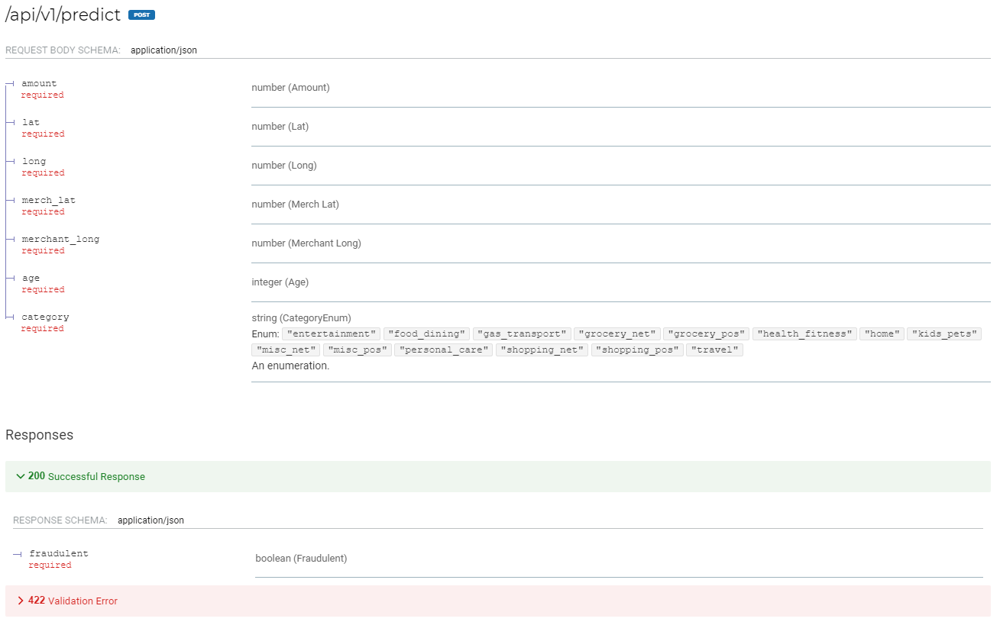
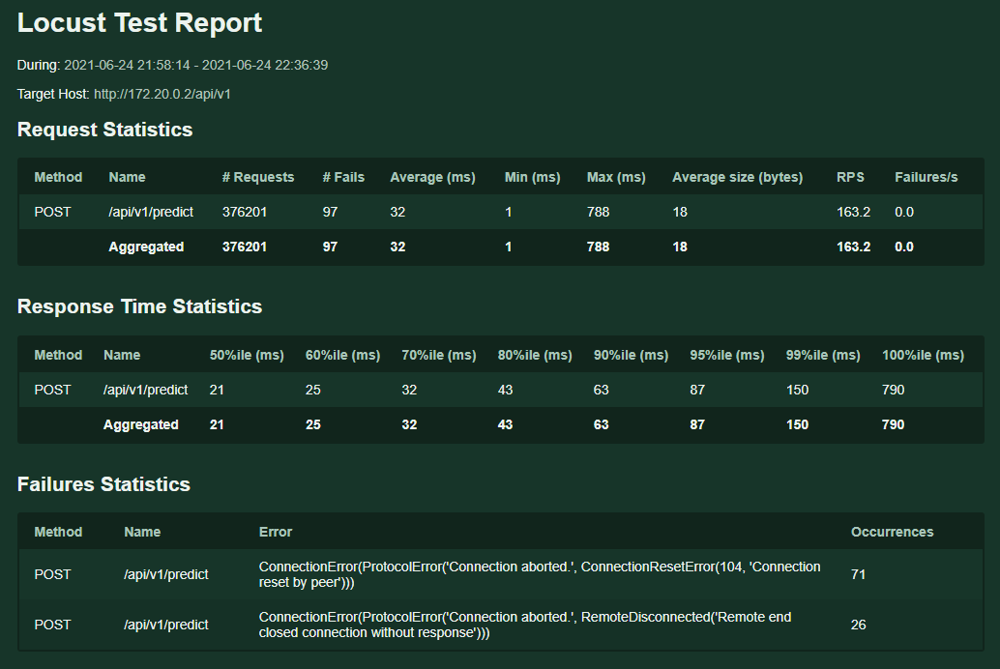
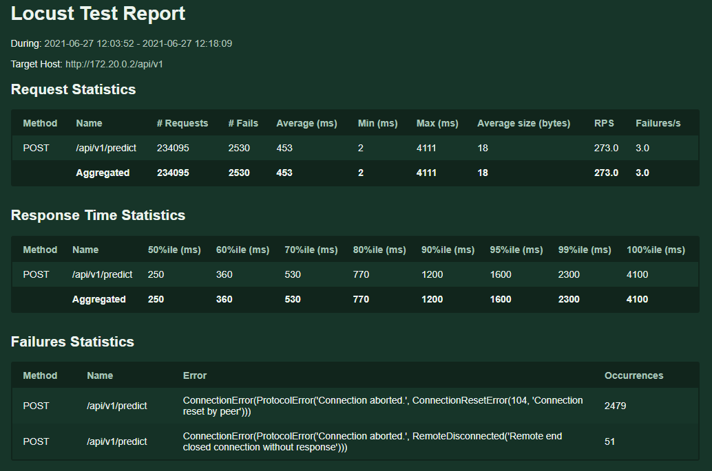
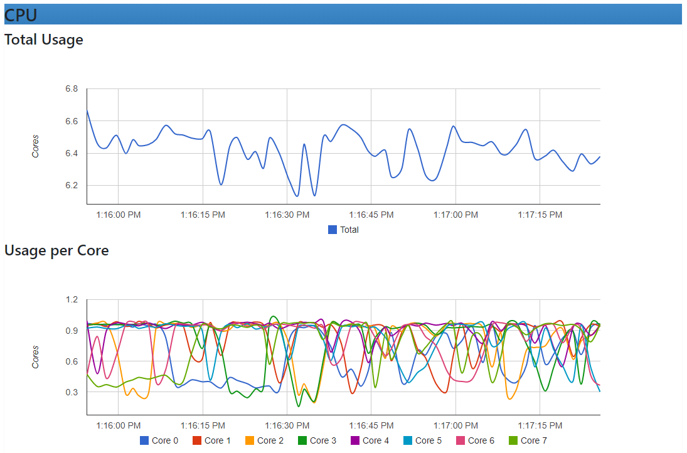

# Votist

An API using [FastAPI](https://fastapi.tiangolo.com/) to screen transactions for fraud.

# Endpoint(s)



# Install

```
docker build -t votist . && docker run -p 80:80 --name=votist_container votist
```

# Documentation

## Random Forest Model

A simple random forest model was developed using data provided by Kartik Shenoy on [Kaggle](https://www.kaggle.com/kartik2112/fraud-detection).

### Feature Engineer

- `dob` was converted to an `age` field, i.e. 1998-01-01 would return 23 (2021).
- `category` was one-hot encoded.

#### Results

##### Confusion Matrix

```
[[257653    195]
 [   502    985]]
```

##### Classification Report

```
              precision    recall  f1-score   support

           0       1.00      1.00      1.00    257848
           1       0.83      0.66      0.74      1487

    accuracy                           1.00    259335
   macro avg       0.92      0.83      0.87    259335
weighted avg       1.00      1.00      1.00    259335
```

##### Accuracy Score

```
0.997312356604392
```

# Performance

Votist was deployed using Docker (i7-8700K @ 3.70Ghz with 8 CPUs, 8GB of Memory) and load tested using [Locust](https://locust.io/).

With `500 users` the system handled `163 requests` per second and responded in `21ms` in the `50%ile` range and `150` in the `95%ile` range. Out of 376201 requests, 97 of them failed. [Click here for the report](./docs/reports/report_500.html).



With `1000 users` the system handled `273 requests` per second and responded in `250ms` in the `50%ile` range and `2300` in the `95%ile` range. Out of 234095 requests, 2530 of them failed. [Click here for the report](./docs/reports/report_1000.html).



Analysing the Votist container CPU usage using [cAdvisor](https://github.com/google/cadvisor) seemed healthy with an average of 90% usage.



We can improve performance by implementing a load balancing and scaling more instances of Votist to distrbiute the load.
Additionally we can change our orchestrator from docker-compose to Kubernetes, to auto-scale our application for larger loads with netter monitoring and better CNIs.
